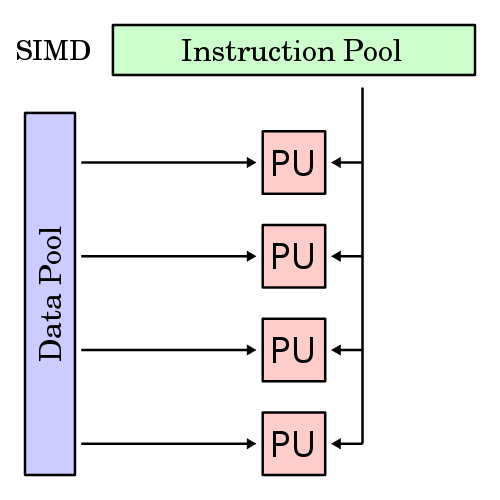

# Lecture 16 — Mostly Data Parallelism

Data parallelism: performing *the same* operations on different input

Task parallelism: is performing *different* operations on different input.

## Single-Instruction Multiple-Data (SIMD)

<!--  -->

In the lecture note ...

```rust
// main.rs

pub fn foo(a: &[f64], b: &[f64], c: &mut [f64]) {
    for ((a, b), c) in a.iter().zip(b).zip(c) {
        *c = *a + *b;
    }
}
```

Without optimization

```asm
movsd xmm0, qword ptr [rcx]
addsd xmm0, qword ptr [rdx]
movsd qword ptr [rax], xmm0
```

With optimization (opt-level=3)

```asm
movupd xmm0, xmmword ptr [rdi + 8*rcx]
movupd xmm1, xmmword ptr [rdi + 8*rcx + 16]
movupd xmm2, xmmword ptr [rdx + 8*rcx]
addpd xmm2, xmm0
movupd xmm0, xmmword ptr [rdx + 8*rcx + 16]
addpd xmm0, xmm1
movupd xmmword ptr [r8 + 8*rcx], xmm2
movupd xmmword ptr [r8 + 8*rcx + 16], xmm0
```

Exercise: try to use <https://godbolt.org/> to explore the `foo` function. You
can also compile `main.rs` on ece machines with and without SIMD by yourselves
using the following commands.

```bash
# on ecetesla
rustc -o with_simd.s    --emit asm -Cllvm-args=--x86-asm-syntax=intel --crate-type rlib main.rs
rustc -o with_simd_o3.s --emit asm -Cllvm-args=--x86-asm-syntax=intel --crate-type rlib -C opt-level=3 main.rs
rustc -o without_simd.s --emit asm -Cllvm-args=--x86-asm-syntax=intel --crate-type rlib -C opt-level=3 -C target-feature=-sse main.rs
```

Question: what can be an issue with SIMD? How to deal with it in Rust? (Answers
are in the lecture note)

## Live-coding

```rust
/*

// runnable on rust explorer

[dependencies]
simdeez = "1.0.8"
*/

// https://github.com/jackmott/simdeez

use simdeez::*;
use simdeez::scalar::*;
use simdeez::sse2::*;
use simdeez::sse41::*;
use simdeez::avx2::*;

simd_runtime_generate!(
// assumes that the input sizes are evenly divisible by VF32_WIDTH
pub fn add(a:&[f32], b: &[f32]) -> Vec<f32> {
  let len = a.len();
  let mut result: Vec<f32> = Vec::with_capacity(len);
  result.set_len(len);
  for i in (0..len).step_by(S::VF32_WIDTH) {
    let a0 = S::loadu_ps(&a[i]);
    let b0 = S::loadu_ps(&b[i]);
    S::storeu_ps(&mut result[0], S::add_ps(a0, b0));
  }
  result
});

fn main() {
  let a : [f32; 4] = [1.0, 2.0, 3.0, 4.0];
  let b : [f32; 4] = [5.0, 6.0, 7.0, 8.0];

  unsafe {
    println!("{:?}", add_sse2(&a, &b))
    // ^ add_sse2 is generated
  }
}
```

## Other

Talk about the Stream VByte case study if time permits
