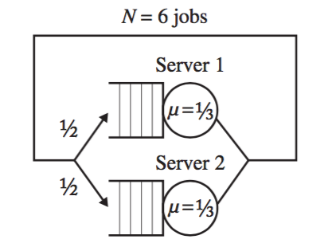
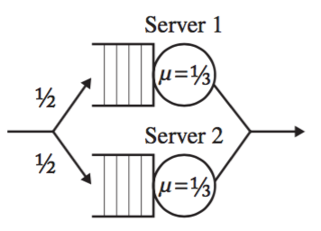
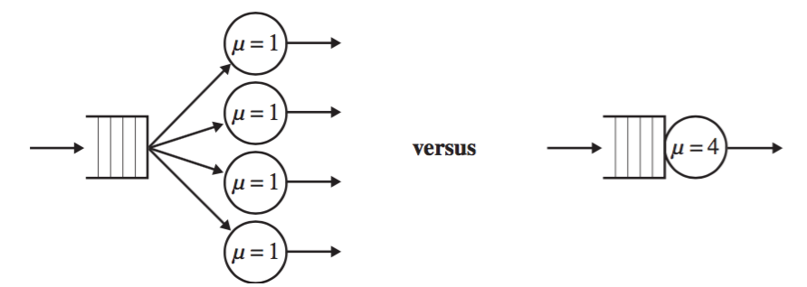
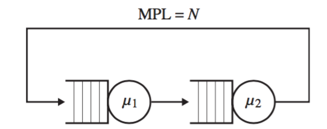

# Lecture 31 — Introduction to Queueing Theory

## Roadmap

Exercises on queueing theory. Since I'm not going to lecture, we can work through the examples. These examples are from:

* Mor Harchol-Balter. *Performance Modeling and Design of Computer Systems*. Cambridge University Press, 2013.

## Doubling the Arrival Rate [5 minutes]

Imagine we have a system with one CPU that serves a queue of jobs in First-Come-First-Served (FCFS) order with an arrival rate λ of 3 jobs per second. Each job takes some amount of time and resources, but we can ignore the particulars for right now. Suppose the average service rate μ is 5 jobs per second (or stated another way, the average job requires 0.2s to service). The system is not overloaded: 3 jobs per second arriving is less than 5 jobs per second being serviced. Our terminology for describing the mean response time will be E[T].

Suppose now that your boss says that tomorrow the arrival rate will double. If you do nothing, you can imagine, there will be a problem: we would have 6 jobs arriving per second, on average, to a system that can service, on average, 5 jobs per second. You have been allocated some budget to replace the CPU with a faster one, and you should choose one so that the jobs still have a mean response time of E[T].


That is, customers should not notice the increase in arrival rate. So, should we (1) double the CPU speed; (2) more than double the CPU speed; or (3) less than double the CPU speed?

## Understanding Bottlenecks (Closed Systems) [5 minutes]

Let's try this one. There are always N=6 jobs running at a time. As soon as a job completes, a new one is started (this is called a *closed system*). Each job goes through to be processed on one of two servers (and it is 50-50 where the job ends up), each of which has a service time μ of 1 job per 3 seconds. Again, depicted below:



What happens if we replace server 1 with something twice as fast (2 jobs per 3 seconds)? What about increasing N? Why is this happening?

What if we drop N?

## Replacing Closed with Open? [5 minutes]

OK, what if we had an open system instead?



And what if we replaced server 1 now? What does that do to E[T]?

## Horse-Sized Duck vs Duck-Sized Horse [5 minutes]

A third example, this time addressing directly the question of do we want one fast server or n slower ones? Horse-sized duck and duck-sized horses jokes aside, what is better if we want to minimize the mean response time when we have non-preemptable jobs (i.e., once started, a job has to run to completion and cannot be interrupted):



* Think about the variability of job sizes. Imagine you are at the grocery store and most people have 12 items or fewer and there's one guy who's buying 85 items. You don't want to be standing in line with milk and eggs behind someone who is trying to buy six of everything, do you?
* What if the load is low?
* What if jobs are interruptible (preemptible)?

## Load Balancing [5 minutes]

Imagine your typical ``server farm''---you have *n* servers that are all responsible for handling incoming requests. Let's imagine all servers are the same (or close enough). There are a few different task assignment policies---ways in which we can assign work to servers:

* Random: Exactly what it sounds like.
* Round-Robin: The ith job goes to host i modulo n.
* Shortest-Queue: The job goes to the server with the shortest queue.
* Size-Interval-Task-Assignment: Short jobs go to one server, medium to another, long to another...
* Least-Work-Left: A job goes to the server that has the least total remaining work, where work is the sum of the size of the jobs.
* Central-Queue: Rather than being assigned to a host directly, when a server needs work to do, it gets the first job in the central queue.

Which of these policies yields the lowest mean response time?

```
¯\_(ツ)_/¯
```

## Red Line Overload [5 minutes]

* What happens if, on average, more jobs arrive than the system can handle?
* OK, let's say that doesn't happen. Now, what happens to throughput when you just increase average service rate μ but you leave incoming job rate the same?
* What if it's a closed system and you increase μ?

## A final closed-system mystery [5 minutes]

Not that open networks are particularly intuitive, but closed networks can kind of mess with our intuition in general. Imagine we have a closed system with Multiprogramming Level (MPL) of N as below:



What is the throughput here?

